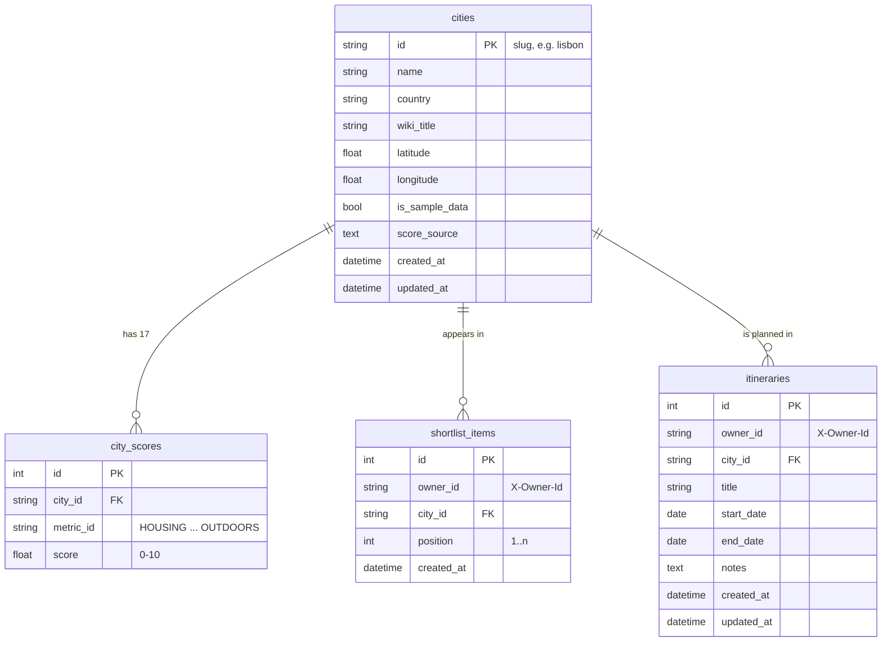

# Database Schema (Phase 2)

Owner: Johnson · Issue: #73 · Status: **draft for standup review**

The four tables the Flask backend stores, implemented as SQLAlchemy models in
#85. This file is the source of truth for those models: change a table here
first, in a PR, then change the model and add a migration.

Built from `docs/decisions.md` and `docs/api-contract.md`:

| Decision | What it means for the schema |
|---|---|
| 2. SQLAlchemy + Flask-Migrate (SQLite local, PostgreSQL on Render) | Only portable column types; every change is a migration |
| 3. Anonymous `X-Owner-Id` | Every user-owned table has an `owner_id` column, so Phase 3 can swap it for a real user id. No users table yet |
| 6. Overall score is computed, not stored | No overall-score column anywhere |
| 7. Wikipedia text and photos stay in the frontend | No summary, image or source URL columns |
| 8. "Sample data" carries over | `cities.is_sample_data` and `cities.score_source` |

## Diagram



## Tables

### 1. `cities`

One row per curated city. Replaces `src/services/curatedCities.js`.

| Column | Type | Null | Default | Notes |
|---|---|---|---|---|
| `id` | VARCHAR(64) | no | — | **Primary key.** The string id the API uses everywhere (`"lisbon"`, `"buenos-aires"`), so `city_id` in every request is this value |
| `name` | VARCHAR(120) | no | — | `Lisbon` |
| `country` | VARCHAR(120) | no | — | `Portugal` |
| `wiki_title` | VARCHAR(200) | no | — | Exact Wikipedia article title (`Austin,_Texas`), used by the frontend to fetch text and photo |
| `latitude` | FLOAT | yes | NULL | CHECK between -90 and 90 |
| `longitude` | FLOAT | yes | NULL | CHECK between -180 and 180 |
| `is_sample_data` | BOOLEAN | no | `true` | Drives the "Sample data" label |
| `score_source` | TEXT | no | `''` | Citation text, as in today's `scoreSource` |
| `created_at` | DATETIME | no | now | |
| `updated_at` | DATETIME | no | now | Refreshed on update |

Constraints:
- `PRIMARY KEY (id)`
- `UNIQUE (name, country)` as `uq_cities_name_country`, so the same city can't be added twice under two ids
- `CHECK` on latitude and longitude ranges

API mapping: `wiki_title` → `wikiTitle`, `is_sample_data` → `isSampleData`,
`score_source` → `scoreSource`.

### 2. `city_scores`

One row per city per metric: 17 rows for a complete city, none for a city
without score data.

| Column | Type | Null | Default | Notes |
|---|---|---|---|---|
| `id` | INTEGER | no | auto | Primary key |
| `city_id` | VARCHAR(64) | no | — | **FK → `cities.id`**, `ON DELETE CASCADE` |
| `metric_id` | VARCHAR(32) | no | — | One of the 17 ids in `docs/api-contract.md` (`HOUSING` … `OUTDOORS`). CHECK: must be in that list |
| `score` | FLOAT | no | — | CHECK between 0 and 10 |

Constraints:
- `UNIQUE (city_id, metric_id)` as `uq_city_scores_city_metric`: one score per metric per city
- `CHECK (score >= 0 AND score <= 10)`
- `CHECK (metric_id IN (...17 ids...))`

Why no `metrics` table: the 17 metrics are a fixed list defined in the API
contract (id, display name, order). Keeping them as a constant in code plus a
CHECK constraint is simpler than a lookup table, and the database still rejects
an unknown metric id.

Computed by the API, never stored (decision 6):
- `teleportCityScore` = `round(average(score) × 10)`, or `null` when the city has no scores
- `hasScores` is built by `api.js` from `scores` not being empty

### 3. `shortlist_items`

A city saved to one owner's shortlist. Replaces the `localStorage` list.

| Column | Type | Null | Default | Notes |
|---|---|---|---|---|
| `id` | INTEGER | no | auto | Primary key (internal; the API identifies items by `city_id`) |
| `owner_id` | VARCHAR(36) | no | — | UUID v4 from `X-Owner-Id`. **Indexed** |
| `city_id` | VARCHAR(64) | no | — | **FK → `cities.id`**, `ON DELETE CASCADE` |
| `position` | INTEGER | no | — | 1-based order. CHECK `position >= 1` |
| `created_at` | DATETIME | no | now | |

Constraints:
- `UNIQUE (owner_id, city_id)` as `uq_shortlist_owner_city`: an owner can't
  shortlist the same city twice. The API turns a violation into
  `409 already_in_shortlist`
- `INDEX (owner_id)`: every shortlist request filters by owner

Why `position` is not unique: `PUT /api/shortlist/order` rewrites every
position in one request, and a `UNIQUE (owner_id, position)` constraint would
fail halfway through (SQLite can't defer constraints). The endpoint keeps
positions as 1..n with no gaps instead, as the API contract specifies.

### 4. `itineraries`

A trip an owner plans to a city.

| Column | Type | Null | Default | Notes |
|---|---|---|---|---|
| `id` | INTEGER | no | auto | Primary key, returned as `id` |
| `owner_id` | VARCHAR(36) | no | — | UUID v4 from `X-Owner-Id`. **Indexed** |
| `city_id` | VARCHAR(64) | no | — | **FK → `cities.id`**, `ON DELETE RESTRICT` |
| `title` | VARCHAR(200) | no | — | CHECK: not empty |
| `start_date` | DATE | no | — | |
| `end_date` | DATE | no | — | CHECK `end_date >= start_date` |
| `notes` | TEXT | no | `''` | Optional in the API; stored as empty text |
| `created_at` | DATETIME | no | now | |
| `updated_at` | DATETIME | no | now | Refreshed on update |

Constraints:
- `CHECK (end_date >= start_date)` as `ck_itineraries_dates`
- `CHECK (title <> '')`
- `INDEX (owner_id)`

`ON DELETE RESTRICT` here, unlike the shortlist: an itinerary is user-written
content, so deleting a city must not silently delete people's trips. The
database refuses the delete until those itineraries are handled.

## Relationships

| From | To | Type | On delete |
|---|---|---|---|
| `city_scores.city_id` | `cities.id` | many-to-one | CASCADE |
| `shortlist_items.city_id` | `cities.id` | many-to-one | CASCADE |
| `itineraries.city_id` | `cities.id` | many-to-one | RESTRICT |

A city has many scores, appears in many shortlists and can have many
itineraries. Shortlist items and itineraries are independent of each other:
an itinerary does not need the city to be in the shortlist (see "Open
questions").

## Example rows

```text
cities          ('bangkok', 'Bangkok', 'Thailand', wiki_title='Bangkok',
                 is_sample_data=true, score_source='Internet Access: Ookla …')
city_scores     (city_id='bangkok', metric_id='COST_OF_LIVING', score=5.7)
                (city_id='bangkok', metric_id='INTERNET_ACCESS', score=10.0)
                …15 more
shortlist_items (owner_id='3f2b8c1e-…', city_id='bangkok', position=1)
itineraries     (id=12, owner_id='3f2b8c1e-…', city_id='bangkok',
                 title='Bangkok workation', start_date='2026-11-03',
                 end_date='2026-11-17', notes='')
```

## Implementation notes (#85)

- **Foreign keys on SQLite:** SQLite ignores them unless `PRAGMA
  foreign_keys=ON` runs on each connection. The models module turns it on for
  SQLite connections so CASCADE and RESTRICT behave the same locally as on
  PostgreSQL.
- **Named constraints:** every unique and check constraint has an explicit
  name, so later migrations can drop or change them on both databases.
- **Portable types only:** `String`, `Integer`, `Float`, `Boolean`, `Text`,
  `Date`, `DateTime`. Nothing SQLite-only or Postgres-only.
- **Migrations:** tables are created by `flask --app wsgi db upgrade`, never
  `db.create_all()`.
- **Seeding** (separate ticket): copy `curatedCities.js` into `cities` +
  `city_scores`, converting metric names to ids (`Cost of Living` →
  `COST_OF_LIVING`). Safe to run twice (upsert by `cities.id`).

## Open questions for standup

1. **Itineraries when a city leaves the shortlist:** they are independent in
   this schema (no link to `shortlist_items`). The decisions log says this is
   settled in the Day 5 cross-feature checks. If they should go together, it's
   an API rule, not a schema change.
2. **Persisting the comparison selection** (stretch, undecided): if it goes
   ahead, add a fifth table `comparisons (owner_id UNIQUE, city_a_id FK,
   city_b_id FK, CHECK city_a_id <> city_b_id)`.
